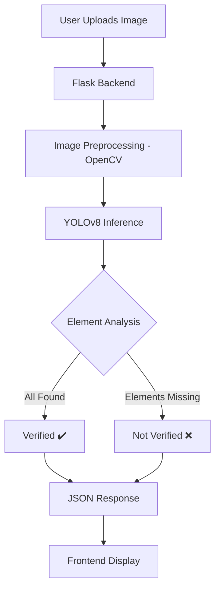

# 🛡️ DocVerify - Advanced Document Verification System


## 📋 Table of Contents
- [Overview](#-overview)
- [Tech Stack](#-tech-stack)
- [Key Features](#-key-features)
- [System Architecture](#-system-architecture)
- [Getting Started](#-getting-started)
- [Usage](#-usage)
- [Troubleshooting](#-troubleshooting)
- [Contributors](#-contributors)

---

## 🌟 Overview

**DocVerify** is a high-performance, AI-driven document verification system specifically designed for validating identity documents like Aadhar cards. Leveraging the power of **YOLOv8** (You Only Look Once), the system performs real-time object detection to identify and verify critical security features, ensuring document authenticity and completeness.

Developed as a modern web application, DocVerify provides an intuitive interface for users to upload documents and receive detailed verification reports within seconds.

---

## 💻 Tech Stack

| Category | Technologies |
| :--- | :--- |
| **Backend** |   |
| **AI / Machine Learning** |    |
| **Frontend** |    |
| **Visualization** |   |

---

## 🚀 Key Features

- 🤖 **AI-Powered Detection**: Deep learning models trained on thousands of document samples.
- ⚡ **Real-Time Verification**: Instant analysis of document elements.
- 🔍 **Granular Validation**: Checks for 8+ specific elements (QR Code, Name, Photo, etc.).
- 📊 **Detailed Reporting**: Visual feedback on detected and missing elements.
- 🎨 **Modern UI**: Sleek, responsive interface with drag-and-drop support.
- 📈 **Performance Metrics**: Included scripts for training and validation analysis.

---

## 🏗️ System Architecture



---

## 🛠️ Getting Started

### Prerequisites
- Python 3.8 or higher
- Pip (Python package manager)

### Installation

1. **Clone the repository**
   ```bash
   git clone https://github.com/v3nom-95/doc-verification.git
   cd doc-verification
   ```

2. **Set up Virtual Environment (Recommended)**
   ```bash
   python -m venv venv
   source venv/bin/activate  # Windows: venv\Scripts\activate
   ```

3. **Install Dependencies**
   ```bash
   pip install flask opencv-python ultralytics torch matplotlib seaborn pandas
   ```

---

## 📲 Usage

1. **Start the Application**
   ```bash
   python app.py
   ```

2. **Access the Portal**
   Open your browser and navigate to `http://127.0.0.1:5000`

3. **Verify Document**
   - Click "Choose File" or Drag & Drop an image.
   - Wait for the AI to process and display the results.

---

## 🔧 Troubleshooting

### ⚠️ Common Issues

- **500 Internal Server Error**: This usually occurs if the AI model file is missing. Ensure the model exists at:
  `New folder/ps/adharmodel/best2.pt`
- **Invalid File Type**: Ensure you are uploading only `.jpg`, `.jpeg`, or `.png` files.
- **Low Confidence Scores**: Ensure the document is well-lit and the image quality is high for better detection.

---


<p align="center">Made with ❤️ for Academic Excellence</p>
